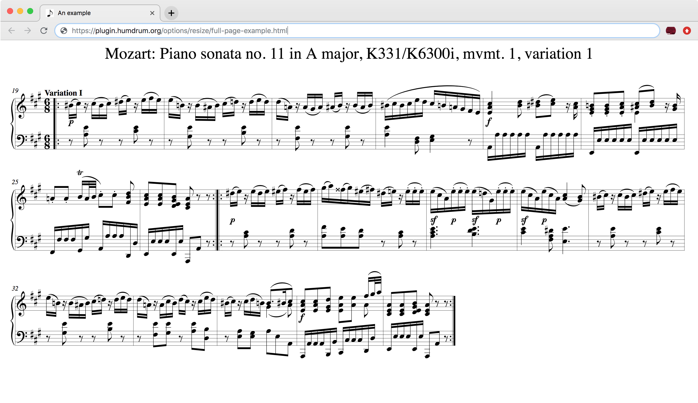
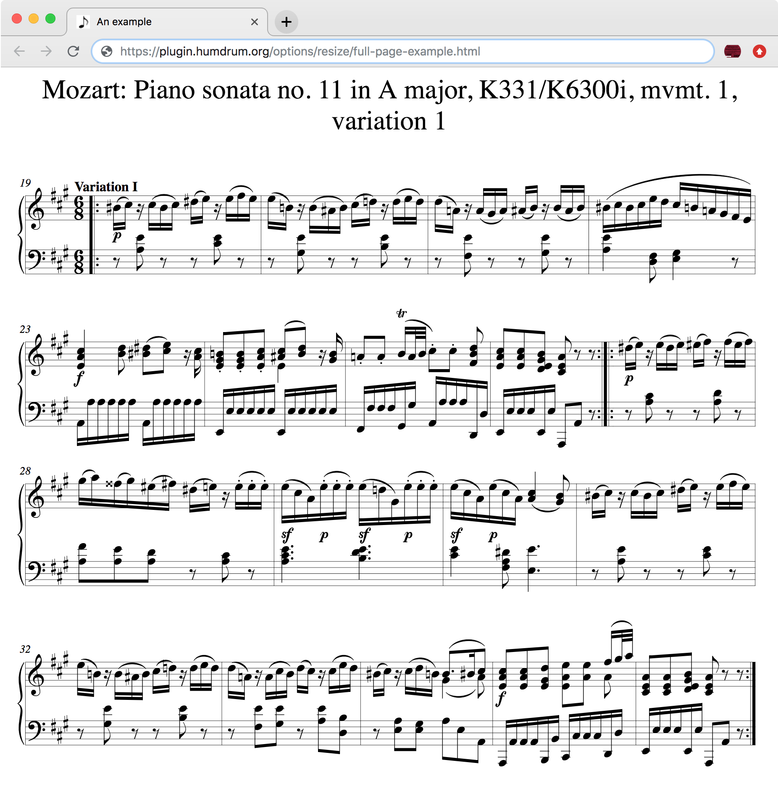

---
vim:	ts=3:ft=liquid
---



<style>
section {
	min-height: 1000px;
}
</style>


# Resizing music notation #

Automatic resizing of a musical example is done in the Humdrum notation
plugin by setting the `autoResize` option to true.

This page demonstrates how to automatically resize music notation when the
web browse changes size, and how to automatically resize music notation
inside of a `<div>` element (or similar) within a webpage. Resizing
in this context means to change the width of the music while keeping
the same zoom scale. In other words, the music is re-typeset whenever
the width of its HTML container is changed.  


# Resizing music in a div #

The following example music can be resized according to the width of the
following red box.  Try resizing the red box by dragging the bottom right
corner of the box.  You can even drag the box out into the right margin
of the page beyond the text.  When the music cannot fully be displayed
inside of the box, then the contents of the box will become scrollable.



<p style="margin-top:20px;"> 
The above example was generated with this HTML code:
</p>

```html

```


# Resizing incipits #

Incipits are short excerpts from the start of a work or movement.  Use the
`incipit: true` option to display only the first system of the music
contained in the example.  Then to resize the incipit, also add the
`autoResize: true` option as demonstrated in the following example.
Try dragging the right bottom corner of the red box to the left and
right to resize the incipit:





<p style="margin-top:20px;"> 
Here is the HTML code that created the above example:
</p>

```html

```

# Full-page resizing #

This webpage limits the text and music notation to a region smaller than
the full width of the web-browser window. Click on <a target="_blank"
href="full-page-example.html">this link</a> to view a full page example,
where the music will be resized to the full width of the window.

Here is an example of the music when the browser is wide:




And here is an example of the music when the browser is narrow:




The HTML code of the example webpage is:

```html

```

Try copy-and-pasting this source code into an HTML page and view it on your
local browser (usually by double-clicking on the file in the Desktop).



	The following data is used to print some music in the header of this page.
	The include file _includes/music-banner.html reads this data and creates
	the notation in the header.  If there is a !!!title: record in the
	Humdrum data below, then it will be placed above the musical example.



<div style="display:none" id="title-notation-source">
!!!title: Mozart: Piano sonata no. 11 in A major, K331/K<sup>6</sup>300i, mvmt. 2: Menuetto and Trio

</div>


