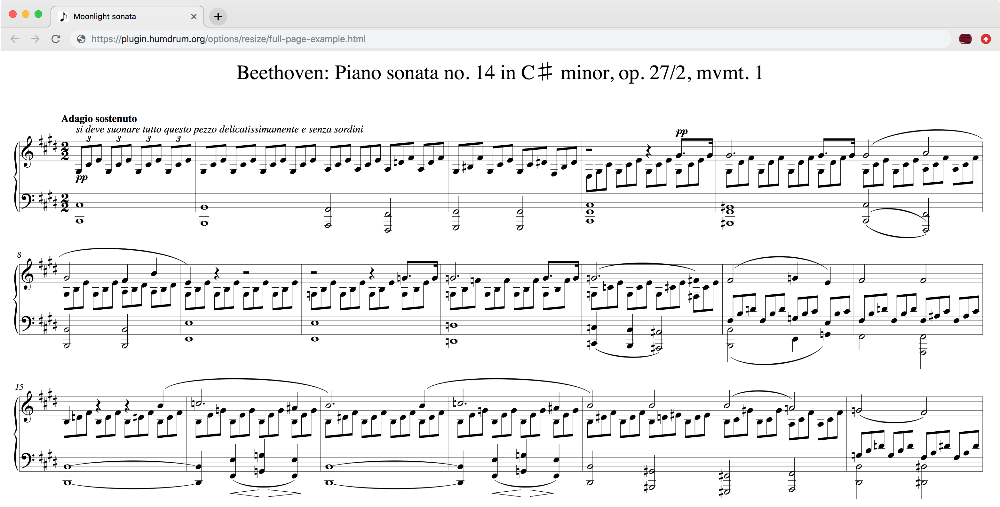
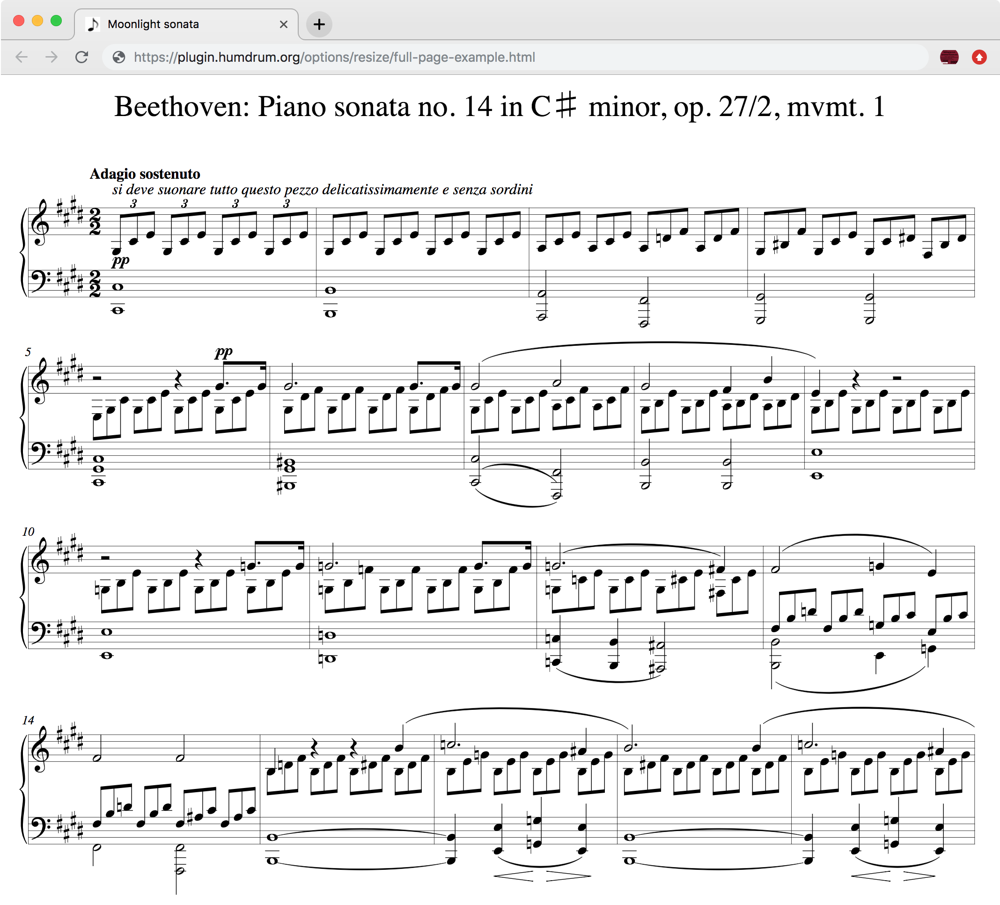
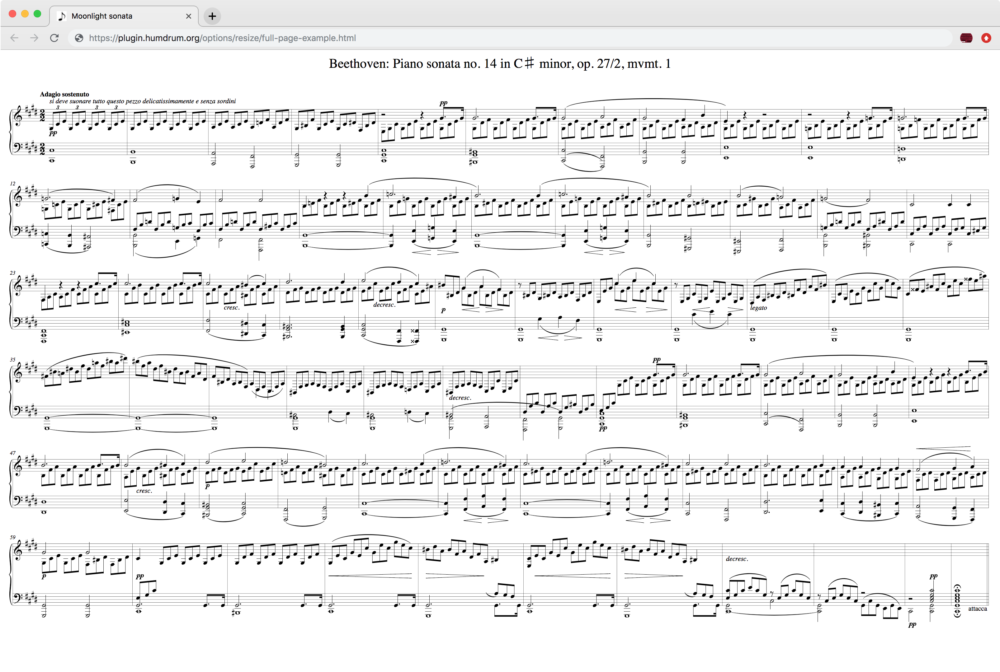

---
vim:	ts=3:ft=liquid
---



<style>
section {
	min-height: 1000px;
}
</style>


# Resizing music notation #

Automatic resizing of a musical example can be done with the Humdrum
notation plugin by setting the `autoResize` option to true.

This page demonstrates how to automatically resize music notation when
the web browser changes size, as well as resizing music notation inside
of a `<div>` element (or similar) within a webpage. Resizing in this
context means to change the width of the music while keeping the same
zoom scale. In other words, the music is re-typeset whenever the width
of its HTML container changes.


# Resizing music in a div #

The following example music can be resized according to the width red box
that contains it.  Try resizing the red box by dragging the bottom right
corner of the box.  You can even drag the box out into the right margin
of the page beyond the text.  When the music cannot be fully displayed
inside of the box, the contents of the box will become scrollable.



<p style="margin-top:20px;">
The above example was generated with this HTML code:
</p>

```html

```

Note that the Safari web-browser  will not let you resize an element to
make it smaller, only larger.


# Resizing incipits #

Incipits are short excerpts from the start of a work or movement.  Use the
`incipit: true` option to display only the first system of the music
contained in the example.  Then to resize the incipit, also add the
`autoResize: true` option as demonstrated in the following example.
Try dragging the right bottom corner of the red box to the left and
right to resize the incipit:





<p style="margin-top:20px;">
Here is the HTML code that created the above example:
</p>

```html

```


# Full-page resizing #

This webpage limits the text and music notation to a region smaller than
the full width of the web-browser window. Click on <a target="_blank"
href="full-page-example.html">this link</a> to view a full-page resizing
example, using the first movement of Beethoven's <i>Moonlight</i> sonata.
The music will be resized to the full width of the window and overflow
of the music off the bottom of the page will be scrollable.

Here is an example of the music when the browser is wide:

<a target="_blank" href="moonlight-wide.png"></a>

And here is an example of the music when the browser is narrow:

<a target="_blank" href="moonlight-narrow.png"></a>

You can also rescale the page (typically with the command or control key in
combination with the plus/minus keys).  Here is an example of zooming
out to view the full <i>Moonlight</i> sonata first movement in the
web browser:

<a target="_blank" href="moonlight-all.png"></a>

You can click on any of the above images to view them in more detail.


The HTML code of the example webpage is:

```html

```

Try copy-and-pasting this source code into an HTML page and view it on your
local browser (usually by double-clicking on the file in the Desktop).


# Resizing on your own #

Instead of using `autoResize: true`, you can alternatively control
music re-drawing yourself by setting up an event listener that triggers
when the size of the window changes.  Here is an example of this:




Here is the source code for the above example:

```html

```

The `postFunction` parameter in the options to `displayHumdrum()` contains
this function:

```javascript
function (baseid) {
   window.addEventListener("resize", function() {
      displayHumdrum(baseid);
   })
}
```

which adds and event listener that is run every time the window is resized (resizing
based on other elements inside of a webpage is more difficult to implement).  The function
given to `postFuction` will be given the ID of the Humdrum script (which is "manual" in
this case).  The function call `displayHumdrum(id)` can be used after initial
setup to redraw the notation with the data store in the Humdrum script that has the
given ID.


# Resizing with clicks #

Here is another example where you can click on the music notation to toggle
between paragraph width and full-screen width:




Each time the music is clicked on, it is re-typeset for the space it has available.
Also notice in the HTML content below for this example, the music is displayed in
two sizes: at `scale:20` when it is in the paragraph, and at `scale:35` when it
is displayed with a full-window width.

```html

```


# Zoom with clicks #


If you want to keep the same layout for the small and large versions of 
some music notation, then it is not necessary to re-typeset the music for
different sizes.  In this example, clicking on the music will expand the
notation to the full-width of the music, where the resizing is done
by scaling the SVG image to the full width of the window rather than
regenerating a new SVG image:




Notice that this example is much more responsive when clicking on the notation.
This is because the music notation is not recalculated after each click&mdash;only
the size of the SVG image is changed.  Also notice that the SVG image's size
will be adjusted to the full width of the window when in expanded view.

Here is the HTML code for the example:

```html

```


# Incipit to full page #

Below is an example of showing an incipit in the text region.  After
clicking on the incipit, the full score will be displayed in the div,
covering the entire page.  Clicking on the full-page example will revert
the example to the incipit again.





HTML code for this example:

```html

```

The Javascript code is fairly complicated to (1) buffering the incipit
SVG so that it does not have to be regenerated every time (the incipit
does not resize, so no need to generate it again).  An in-progress icon
is also displayed for the mouse while the full-page notation is generated,
since this takes a second or two.



	The following data is used to print some music in the header of this page.
	The include file _includes/music-banner.html reads this data and creates
	the notation in the header.  If there is a !!!title: record in the
	Humdrum data below, then it will be placed above the musical example.



<div style="display:none" id="title-notation-source">
!!!title: Mozart: Piano sonata no. 11 in A major, K331/K<sup>6</sup>300i, mvmt. 2: Menuetto and Trio

</div>


