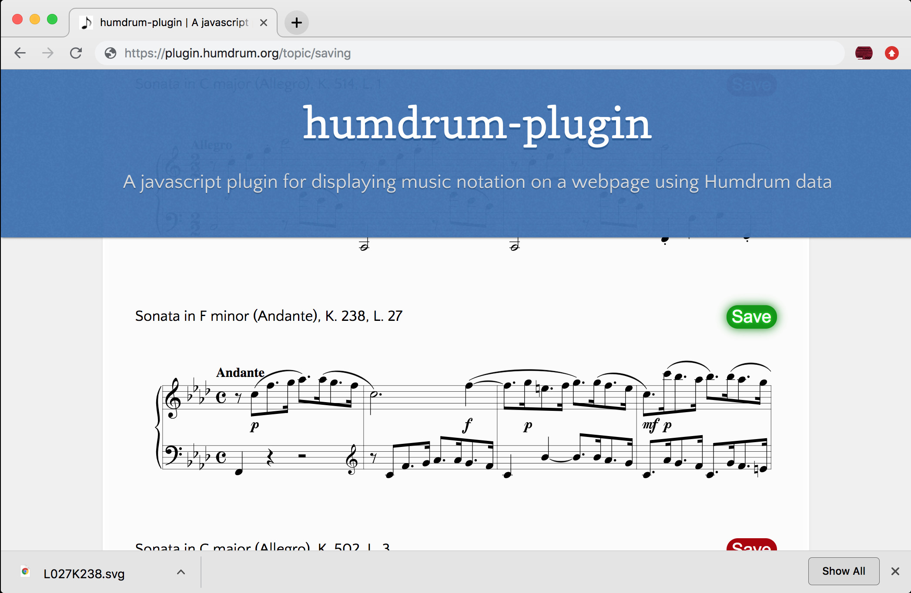
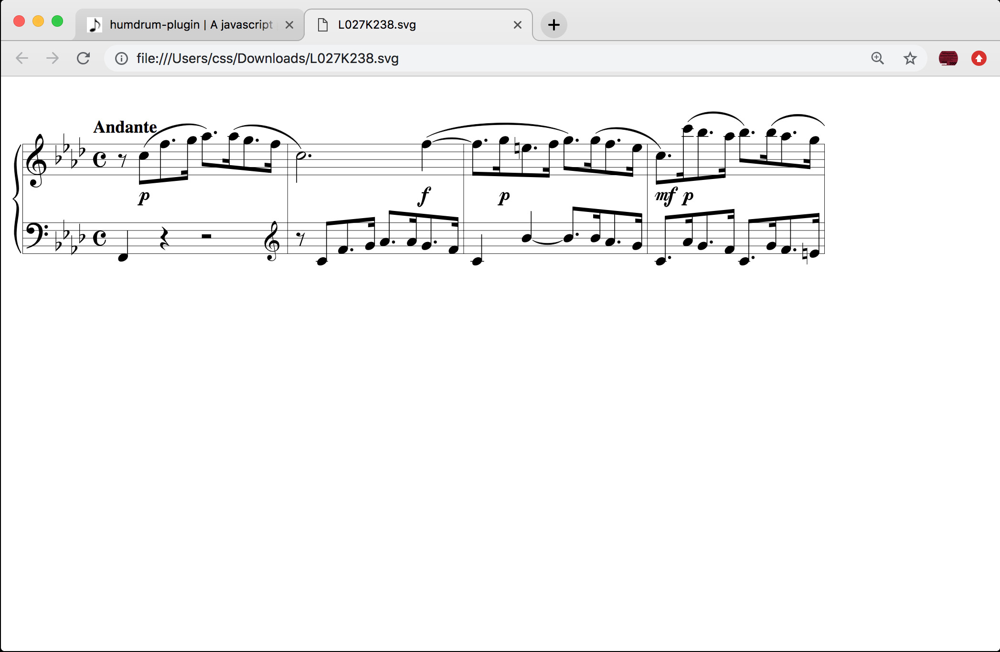

---
vim:	ts=3
---

<style>
section {
	min-height: 1000px;
}
</style>






# Saving notation SVGs #

This page demonstrates how to save the SVG renderings of Humdrum
data created by the Humdrum notation plugin.  A function called
`saveHumdrumSvg()` is provided with the Humdrum notation plugin that
can save Humdrum-generated SVG images on a page.

For example, a list of incipits is shown below for several keyboard
sonatas by Domenico Scarlatti.  Click on the red button to the right of
each incipit to save that incipit image to the local computer's hard disk.
The location that the file will be saved is dependent on settings within
your browser (typically either in Downloads or the Desktop).




After clicking on a <span class="demo button">Save</span> button, you should see evidence that the image
was downloaded, such as in the following image where the file `L027K238.svg` has been downloaded:

<style>
img.figure {
	width: 75%;
	display: block;
	margin-left: auto;
	margin-right: auto;
	border: 1px solid #999999;
	border-radius: 3px;
	box-shadow: 10px 10px 5px #cccccc;
}
</style>




Opening the saved SVG image into another tab in the web browser:



Here is the source code for the placement of the incipits on the page:

<div class="scrolling">



</div>

The `spacingStaff: 12` option is used to set a minimum distance between
the grand-staff staves so that the width is more consistent across
multiple incipits.


Notice that each button has a click callback function, such as:

```javascript
saveHumdrumSvg('L001K514')
```

This means to save the SVG image associated with the Humdrum script element with the ID `L001K514`.  You 
can also given an optional filename; otherwise, the ID will be used as the filename base, saving to a
file called `L001K514.svg` in this case.  To save to a file called `scarlatti-kirkpatrick-514.svg`, the
callback would be:

```javascript
saveHumdrumSvg('L001K514', "scarlatti-kirkpatrick-514.svg")
```


Here is the button styling code that was used in the example:

```html

```

# Saving all SVG images #

When no arguments are given to the `saveHumdrumSvg()` function, all SVG images created by the
Humdrum notion plugin will be saved.  Each image will be saved to a separate file based on the
ID of the Humdrum script element that contains the source data for the SVG image. For example,
click on the following button to save all images on the page to your local hard disk:

<span class="button" onclick="saveHumdrumSvg()">Save all incipits</span>

There are also more examples further below which will also be saved when clicking the above button.

The HTML code for the button is:

```html
<span class="button" onclick="saveHumdrumSvg()">Save all notation</span>
```

# Saving Humdrum data #

Similar to `saveHumdrumSvg()`, another function called `saveHumdrumText()`
will save the Humdrum data that generated an SVG image.  Below is an
example that now has two buttons to the right of each incipit: one to
save the SVG image and the other to save the Humdrum data for the incipit.





Here is the HTML code that was used to generate the above example:


<div class="scrolling">



</div>

Notice any filters located in the options used in `displayHumdrum()`
will be applied to the saved Humdrum data files.   For example, each of
the downloaded Humdrum files will be in a different key.  Also notice
that the options specify that only an incipit will be displayed, but
the entire Humdrum data file was downloaded from Github, and therefore
the entire score will be saved for each Humdrum file.


# Saving all Humdrum data #


Similar to calling `saveHumdrumSvg()` with no arguments, all Humdrum data will be saved to individual
files if `saveHumdrumText()` is called with no arguments:

<span class="button" onclick="saveHumdrumText()">Save all Humdrum data</span>

The HTML code for the above button:

```html
<span class="button" onclick="saveHumdrumText()">Save all Humdrum data</span>
```


	The following data is used to print some music in the header of this page.
	The include file _includes/music-banner.html reads this data and creates
	the notation in the header.  If there is a !!!title: record in the
	Humdrum data below, then it will be placed above the musical example.


<script type="text/x-humdrum" id="title-notation-source">
!!!title: <a target="_blank" href="http://kern.humdrum.org/cgi-bin/ksdata?file=L016K306.krn&l=users/craig/classical/scarlatti/longo&format=pdf">Scarlatti: Sonata in E-flat major, K. 306, L. 16</a>

</script>
