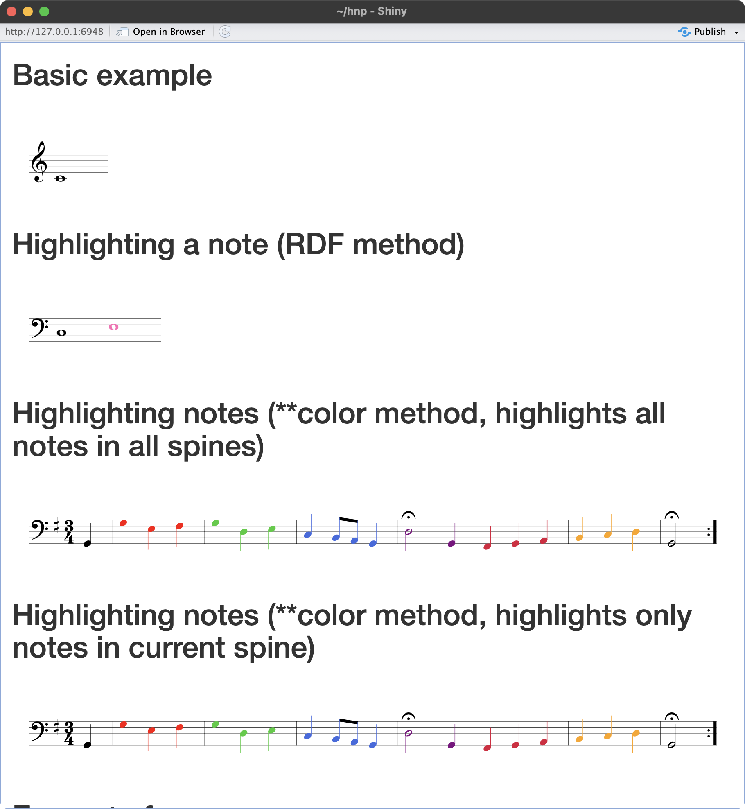

---
vim:	ts=3
---


# Using HNP in Shiny apps


Here is an example of using HNP in a Shiny App:


```
# install.packages("shiny")
library(shiny)

colorExample <- "**kern	**color
*clefF4	*
*k[f#]	*
*G:	*
*M3/4	*
*MM100	*
4GG	.
=1	=1
4G	red
4E	.
.	.
4F#	.
=2	=2
4G	limegreen
4D	.
.	.
4E	.
=3	=3
4C	royalblue
.	.
8BBL	.
8AAJ	.
4GG	.
=4	=4
2D;	purple
4GG	.
=5	=5
4FF#	crimson
4GG	.
4AA	.
=6	=6
4BB	orange
4C	.
4D	.
.	.
=7	=7
2GG;	black
=:|!	=:|!
==	==
*-	*-
"

colorExample2 <- "**kern
*clefF4
*k[f#]
*G:
*M3/4
*MM100
4GG
=1
*color:red
4G
4E
4F#
=2
*color:limegreen
4G
4D
4E
=3
*color:royalblue
4C
8BBL
8AAJ
4GG
=4
*color:purple
2D;
4GG
=5
*color:crimson
4FF#
4GG
4AA
=6
*color:orange
4BB
4C
4D
=7
*color:black
2GG;
=:|!
==
*-"

ui <- fluidPage(
  tags$head(
    tags$script(src = "https://plugin.humdrum.org/scripts/humdrum-notation-plugin-worker.js")
  ),
  
  tags$script(
    HTML(paste(
      "displayHumdrum({source: 'my-score', autoResize: 'true'});",
      "displayHumdrum({source: 'color1', autoResize: 'true'});",
      "displayHumdrum({source: 'color2', autoResize: 'true'});",
      "displayHumdrum({source: 'color3', autoResize: 'true'});",
      "displayHumdrum({source: 'mozart', autoResize: 'true', filter: 'myank -m 1-4', url: 'https://raw.githubusercontent.com/craigsapp/mozart-piano-sonatas/master/kern/sonata10-2.krn'});",
      "displayHumdrum({source: 'mozart2', autoResize: 'true', filter: ['myank -m 1-4', 'transpose -k C'], url: 'https://raw.githubusercontent.com/craigsapp/mozart-piano-sonatas/master/kern/sonata10-2.krn'});",
      "displayHumdrum({source: 'mozart3', autoResize: 'true', filter: 'myank -m 1-4 | transpose -k G | extract -k 2', url: 'https://raw.githubusercontent.com/craigsapp/mozart-piano-sonatas/master/kern/sonata10-2.krn'});",
      "displayHumdrum({source: 'mozart4', autoResize: 'true', url: 'https://raw.githubusercontent.com/craigsapp/mozart-piano-sonatas/master/kern/sonata10-2.krn'});"
    ))
  ),
  
  HTML("<h1>Basic example</h1>"),
  HTML("<script id='my-score' type='text/x-humdrum'>**kern\n1c\n*-</script>"),
  
  HTML("<h1>Highlighting a note (RDF method)</h1>"),
  HTML("<script id='color1' type='text/x-humdrum'>**kern\n1C\n1E@\n*-\n!!!RDF**kern: @ = marked note, color=hotpink</script>"),
  
  HTML("<h1>Highlighting notes (**color method, highlights all notes in all spines)</h1>"),
  HTML(paste0("<script id='color2' type='text/x-humdrum'>", colorExample, "</script>")),
  
  HTML("<h1>Highlighting notes (**color method, highlights only notes in current spine)</h1>"),
  HTML(paste0("<script id='color3' type='text/x-humdrum'>", colorExample2, "</script>")),
  
  HTML("<h1>Excerpt of a score</h1>"),
  HTML("<script id='mozart' type='text/x-humdrum'></script>"),
  
  HTML("<h1>Excerpt of a score, transpose to C major (array method for filters)</h1>"),
  HTML("<script id='mozart2' type='text/x-humdrum'></script>"),
  
  HTML("<h1>Excerpt of a score, transpose to G major and extract top part (pipe method for filters)</h1>"),
  HTML("<script id='mozart3' type='text/x-humdrum'></script>"),
  
  HTML("<h1>Full score from URL</h1>"),
  HTML("<script id='mozart4' type='text/x-humdrum'></script>")
)

server <- function(input, output, session) {
  
}

shinyApp(ui, server)
```




